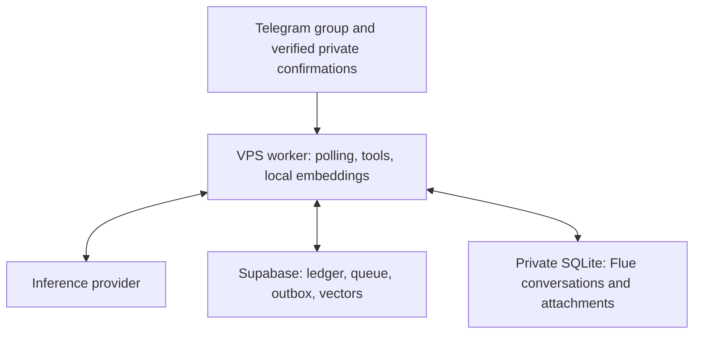

# Architecture

[Español](architecture.es.md) · [README](../README.md)

## Runtime and data ownership

Deepgram transcribes voice audio before interpretation. It is an additional external data processor, not a local speech model.

| Component | Authority |
| --- | --- |
| Telegram intake | Verified sender, group membership and message identity |
| Flue/Pi model loop | Interpretation and proposed tool arguments |
| SQL RPCs | Validation, permissions, duplicate checks and atomic ledger writes |
| Supabase outbox | Retryable message delivery and registered operation receipts |
| SQLite | Durable Flue conversation/runtime state, not financial balances |
| Vector search | Candidate retrieval; never authority for a balance |

The worker claims financial events with bounded attempts. Tool outputs either provide verified information or prepare one terminal action. SQL applies that action with ledger and permission checks. Successful responses use persisted operation receipts. A model statement such as “saved” is not sufficient proof of registration.

## Conversations and delivery

Incomplete operations are persisted as drafts with revisions. Follow-up information updates the selected draft; explicit replies preserve their thread. Other pending conversations must not hijack the most recent exchange. Recent registered operations, missing fields and blockers are structured context rather than relying only on the last chat messages.

When adjacent messages complete the same request, the delivery layer can suppress an obsolete unsent question or update an existing bot message. It rechecks relevance at delivery time. Different actors, topics or explicit reply threads retain separate handling. Delivery leases and idempotency prevent obsolete senders from acknowledging newer work; failed continuations eventually release a still-needed question.

## People and account permissions

The reporter, account manager, household attribution and external counterparty are different concepts. An external tenant or employer does not have to become a household member. The household member associated with an income is not a claim that they were its external sender.

Operations affecting another member's managed accounts require the responsible manager's approval. The database derives affected accounts rather than trusting a model-supplied payer. Batched linked operations wait together before posting. A changed request requires a valid current revision; approval cannot authorize a different amount or account.

Notifications mention the responsible member in the group. A verified member can enable private notifications by starting the bot privately. Private messages accept only authorized confirmation flows, not unrestricted general financial operations. There are at most **three rounds including the first**, at least one hour apart; pending approvals expire after 48 hours. Missed time does not produce a burst of old reminders, and expiry never auto-approves a request.

“My accounts” filters the overview by the verified requesting member. Explicit global/household requests include both members. Both members can still see the shared group's financial messages; this filter is a relevance rule, not access isolation.

## Exact money and corrections

User-facing/tool decimal amounts are strings of COP pesos with up to two decimal places. SQL ledger amounts and signed deltas are integer COP cents. For example, `"1234.56"` pesos becomes `123456` cents. Do not use floating-point arithmetic or remove fractional cents.

Opening balances do not count as income. Paying a card balance is a transfer/debt payment rather than a second purchase. Recorded entries are immutable: corrections add audited reversal/replacement operations. Duplicate detection and retry idempotency are distinct checks.

## Local Spanish embeddings

The worker loads the pinned `Xenova/multilingual-e5-small` revision through Transformers.js, using quantized Q8 inference on CPU. Vectors have 384 dimensions and are normalized. The model is cached outside the release directory and loaded once per process. Inference is serialized with one intra-op and one inter-op thread to bound contention.

Spanish text stays Spanish. E5's `query: ` and `passage: ` prefixes are required role markers; they are not translations. Query and passage embeddings use the same model/version. Hybrid retrieval combines semantic candidates with structured and lexical matching. Retrieved memories do not replace ledger queries for exact balances or permissions.

The first call downloads model assets and initializes the runtime. Later calls reuse the loaded model. Indexing runs in bounded background batches; foreground search can wait behind an inference already running. Total bot latency also includes transcription, model calls, RPCs and Telegram delivery. This repository does not promise a VPS-independent response time.

## Deployment boundary

Only one executor owns Telegram intake and queue processing. The VPS mode uses protected OAuth and backend configuration, durable SQLite and long polling. Edge entry points and older Postgres runtime tooling are retained in the source, but enabling their cron/webhook path alongside the VPS is unsupported. The Supabase financial database is still required; “SQLite runtime” does not mean all financial data moved to SQLite.
