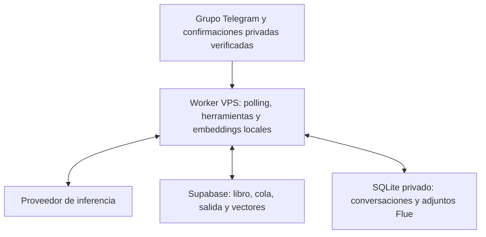

# Arquitectura

[English](architecture.en.md) · [README](../README.es.md)

## Runtime y autoridad de los datos

Deepgram transcribe los audios antes de interpretarlos. Es otro procesador externo de datos, no un modelo local de voz.

| Componente | Autoridad |
| --- | --- |
| Entrada Telegram | Remitente verificado, membresía e identidad del mensaje |
| Bucle Flue/Pi | Interpretación y argumentos propuestos de herramientas |
| RPC SQL | Validación, permisos, duplicados y asientos atómicos |
| Outbox Supabase | Entrega reintentable y comprobantes de operaciones |
| SQLite | Estado durable del runtime/conversaciones, no saldos financieros |
| Búsqueda vectorial | Recuperación de candidatos, nunca autoridad de un saldo |

El worker reclama eventos con intentos limitados. Las herramientas consultan datos verificados o preparan una acción terminal. SQL aplica la acción con controles del libro y permisos. Las respuestas exitosas usan comprobantes persistidos. Que el modelo diga “guardado” no demuestra que exista un registro.

## Conversaciones y entrega

Las operaciones incompletas se guardan como borradores con revisiones. Los mensajes siguientes actualizan el borrador seleccionado; las respuestas explícitas conservan su hilo. Otros pendientes no deben apropiarse del intercambio más reciente. Los registros recientes, campos faltantes y bloqueos se proporcionan como contexto estructurado, sin depender solo de los últimos mensajes.

Si mensajes seguidos completan una solicitud, la entrega puede suprimir una pregunta obsoleta aún no enviada o actualizar el mensaje del bot. Comprueba nuevamente su vigencia antes de entregarlo. Autores, temas y replies distintos conservan su tratamiento. Los leases e idempotencia impiden que un ejecutor obsoleto confirme trabajo nuevo; una continuación fallida libera después la pregunta que todavía haga falta.

## Personas y permisos de cuentas

El informante, el administrador de la cuenta, la atribución del hogar y la contraparte externa son conceptos distintos. Un arrendatario o empleador no tiene que ser miembro del hogar. Asociar un ingreso a un miembro no significa que ese miembro fue el remitente externo.

Las operaciones que afectan cuentas administradas por otro miembro requieren su aprobación. La base deriva las cuentas afectadas sin confiar solamente en el pagador propuesto por el modelo. Las operaciones enlazadas esperan juntas antes de registrarse. Una solicitud modificada exige revisión vigente; una aprobación no puede autorizar otro importe o cuenta.

Los avisos mencionan al responsable en el grupo. Un miembro verificado puede activar avisos privados iniciando el bot por privado. Ese canal admite confirmaciones autorizadas, no operaciones financieras generales sin restricciones. Hay como máximo **tres rondas incluyendo la primera**, separadas por al menos una hora; las solicitudes vencen en 48 horas. Una interrupción no genera una ráfaga de avisos atrasados y el vencimiento nunca aprueba automáticamente.

“Mis cuentas” filtra el panorama por el miembro solicitante verificado. Las consultas globales/del hogar explícitas incluyen ambos miembros. Ambos siguen viendo los mensajes del grupo; el filtro mejora pertinencia, no aísla el acceso.

## Importes exactos y correcciones

Los importes decimales de usuario/herramientas son cadenas de pesos COP con hasta dos decimales. El libro SQL usa centavos COP enteros y deltas con signo. Por ejemplo, `"1234.56"` pesos se convierte en `123456` centavos. No uses coma flotante ni elimines centavos.

Los saldos iniciales no cuentan como ingresos. Pagar la tarjeta es un traslado/pago de deuda, no otra compra. Los asientos registrados son inmutables: las correcciones agregan reversión y reemplazo auditados. La detección de duplicados y la idempotencia ante reintentos son controles diferentes.

## Embeddings locales en español

El worker carga la revisión fijada de `Xenova/multilingual-e5-small` con Transformers.js e inferencia Q8 en CPU. Los vectores normalizados tienen 384 dimensiones. La caché queda fuera del release y el modelo se carga una vez por proceso. Las inferencias se serializan con un hilo intra-op y otro inter-op para limitar competencia por CPU.

El texto en español sigue en español. Los prefijos E5 `query: ` y `passage: ` indican el rol del texto; no lo traducen. Consultas y documentos usan el mismo modelo/versión. La búsqueda híbrida combina candidatos semánticos con filtros estructurados y coincidencia léxica. Los recuerdos recuperados no reemplazan las consultas al libro para verificar saldos o permisos.

La primera llamada descarga los archivos e inicializa el modelo. Las siguientes reutilizan la instancia. La indexación funciona en lotes de fondo limitados; una búsqueda puede esperar una inferencia ya en curso. La latencia total también incluye transcripción, llamadas al modelo, RPC y entrega Telegram. No se promete un tiempo de respuesta independiente del VPS.

## Límite del despliegue

Un único ejecutor debe controlar la entrada Telegram y la cola. El modo VPS usa OAuth/configuración protegidos, SQLite durable y long polling. El código Edge y las herramientas anteriores de Postgres se conservan, pero activar sus cron/webhook junto al VPS no está soportado. Supabase sigue siendo necesario para las finanzas; “runtime SQLite” no significa que todo el libro se trasladó a SQLite.
